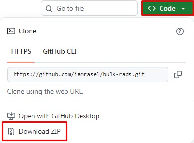
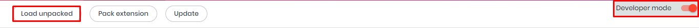

	<h2>~ Bulk Rads ~</h2>

> [!CAUTION]  
> Use at your own risk; I will not be responsible for any mistakes you make.

Bulk Radio Selector is a web extension that helps select all the radio buttons at once on a web page. This extension will only work with Chromium-based web browsers, e.g., Google Chrome, Microsoft Edge, etc.

### Usage Instructions
**How to Install:**
- Download this repo by going to `Code` -> `Download ZIP`, or by clicking [here](https://github.com/iamrasel/bulk-rads/archive/refs/heads/main.zip).
- Extract the downloaded ZIP file.
- Navigate to your browser's `Manage Extensions` window.
- Enable `Developer mode` (top right corner) if it's not already enabled.
- Click on `Load unpacked` and select the folder where you've extracted the ZIP file's contents.
- The extension should now be added to your browser.

**How to Use:**
- Pin the extension to your browser's toolbar (optional, for better accessibility).
- Click on the extension icon; two buttons will appear. You should know what to do with them!
- Clicking any of the buttons will select all the radio buttons present on that specific page.
- Don't move to the next page just yet. Click on the `Complete` button and check the selection count.
- If the selection count doesn't match what you expected, wait a few seconds (e.g., 4–5 seconds) and check the count again. This depends on the server's response time. If the server's load time is good, you won't need to wait at all.
- If the selection count is still lower than expected, just refresh the page. It should be fine now.
- Follow the above steps to complete each page.
- In the `Complete` dialog box, the no match count number will change color based on the selection count.

    
Previews

    <table>
	    <tr>
		    <td></td>
		    <td></td>
		    <td></td>
    	</tr>
    </table>

### Final Words
Just a reminder: use with proper caution, and try not to miss anything. I wish you the best! If you face any issues, feel free to reach out to me.